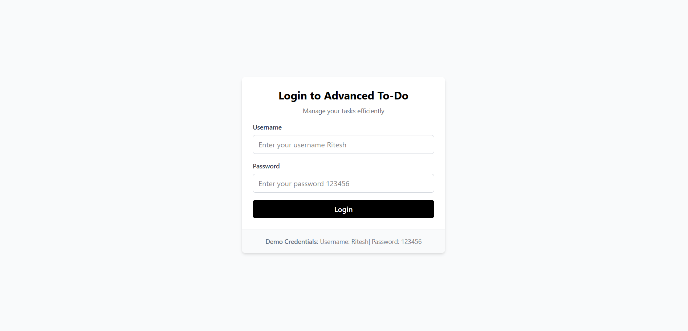
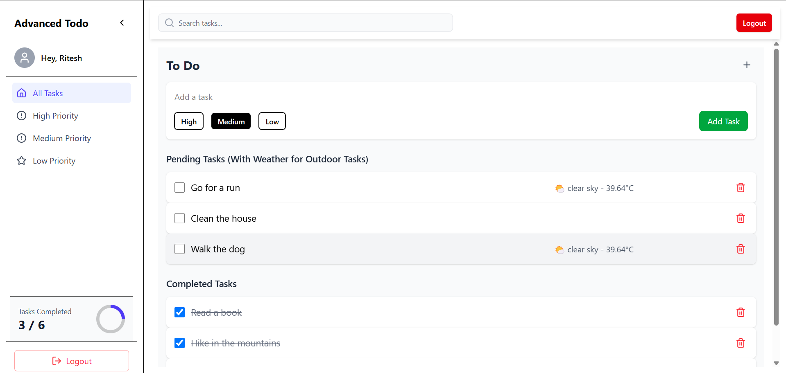
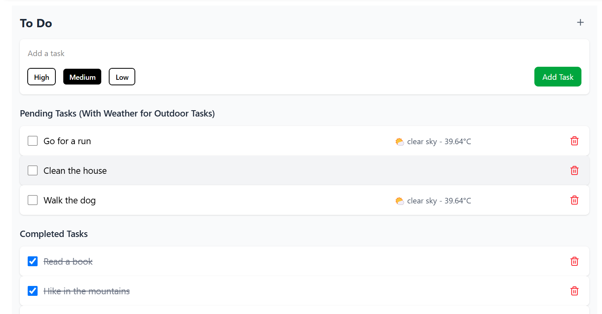

# Project Title

#  To-Do App with Authentication & Weather Integration 

A feature-rich **To-Do List App** built using **React, Redux, Tailwind CSS, and React Router**. It includes **user authentication, task management, priority filtering, and real-time weather updates** for outdoor tasks.


## Features

###  **Authentication**
- User **Login & Logout** with session persistence (`localStorage`)
- **Redux Toolkit** for authentication state management

###  **Task Management**
- **Add, Complete, and Delete** tasks  
- **Priority Levels:** High 🔴, Medium 🟠, Low 🔵  
- **Progress Tracker:** See completed vs pending tasks

###  **Weather Integration**
- **Outdoor Tasks Only:** Shows **real-time weather** (e.g., 🌤 28°C, Clear Sky)
- Uses **OpenWeather API** for live weather updates

###  **UI & Navigation**
- **Sidebar Navigation** with filter options  
- **Dashboard with Task Overview**
- 


## Tech Stack

## 🛠️ **Tech Stack**
- **Frontend:** React, Redux Toolkit, Tailwind CSS
- **State Management:** Redux Toolkit
- **Routing:** React Router DOM
- **Weather API:** OpenWeather API
- **Persistence:** LocalStorage for session management


## Environment Variables

To run this project, you will need to add the following environment variables to your .env file

`VITE_WEATHER_API_KEY`


## Run Locally

Clone the project

```bash
  git clone https://github.com/ritesh-doijad/advance-todo.git
```

Go to the project directory

```bash
 cd advanced-todo     
```

Install dependencies

```bash
  npm install
```

Start the server

```bash
  npm run dev
```


## Screenshots







